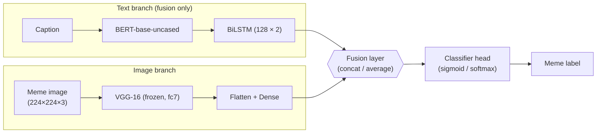

# Multimodal Meme Classifier

[](LICENSE)
[](https://www.python.org/)
[](https://www.tensorflow.org/)
[](https://ieeexplore.ieee.org/document/10825758)

Official implementation of **"Multimodal Deep Learning"** (IEEE, 2024) — a study on
classifying internet memes by combining text (BERT) and image (VGG-16)
modalities via *early-* and *late-fusion* strategies.

- 📄 **Paper**: [IEEE Xplore 10825758](https://ieeexplore.ieee.org/document/10825758) · [local PDF](docs/paper.pdf)
- 🗂 **Original paper notebooks** (archival): [MultimodalDeepLearning_OnlineMemeClassification](https://github.com/stephaniehan/MultimodalDeepLearning_OnlineMemeClassification)

---

## Abstract

Memes are a multimodal form of speech — caption text plus an image — widely
used on social media. Treating meme label classification purely as a text
or purely as an image problem leaves signal on the table. This project
builds BERT-only, VGG-16-only, and two text+image fusion architectures
(early and late), then compares them on a 5-class subset of the
[ImgFlip-Scraped Memes Caption](https://www.kaggle.com/datasets/abhishtagatya/imgflipscraped-memes-caption-dataset?select=memes_data.tsv)
dataset. Early fusion converges fastest on the multiclass task because it
mixes features at the embedding level rather than the inference level.

## 🎯 Key Results

Training accuracy from the IEEE paper figures. Full table with context:
[`assets/paper_results/main_table.md`](assets/paper_results/main_table.md).

| Model                | Task       | Epoch-1 acc | Epoch-10 acc |
| -------------------- | ---------- | :---------: | :----------: |
| VGG-16 (image only)  | Binary     |    0.93     |     0.99     |
| VGG-16 (image only)  | Multiclass |    0.32     |     0.99     |
| BERT (text only)     | Binary     |   ~0.80     |     0.99     |
| BERT (text only)     | Multiclass |   ~0.80     |     0.99     |
| Early fusion         | Binary     |   ~0.50     |     0.99     |
| **Early fusion**     | **Multiclass** | **0.38**|   **0.99**   |
| Late fusion          | Binary     |   ~0.50     |     0.99     |
| Late fusion          | Multiclass |    0.22     |     0.99 (ep. 8) |

Binary task = {Who Killed Hannibal, Scared Cat}.
Multiclass task adds {Sleeping Shaq, Uncle Sam, Peter Parker Cry}.

## 🏗️ Architecture

> Rendered inline by GitHub (Mermaid). The `assets/architecture.svg`
> slot is reserved for a hand-drawn replacement.



Text-only and image-only models are the same two branches without the
fusion layer. Early fusion concatenates text and image features before
the classifier; late fusion runs the two classifier heads independently
and averages their probability distributions.

## 🛠 Installation

```bash
git clone https://github.com/<your-user>/multimodal-meme-classifier.git
cd multimodal-meme-classifier

# Python 3.11 virtualenv or conda env recommended (TensorFlow 2.15 pins).
python -m venv .venv && source .venv/bin/activate
pip install -r requirements.txt
```

For development (includes `pytest`, `jupyter`):

```bash
pip install -r requirements-dev.txt
```

## 📚 Dataset

The paper uses a preprocessed subset of
[ImgFlip-Scraped Memes Caption](https://www.kaggle.com/datasets/abhishtagatya/imgflipscraped-memes-caption-dataset?select=memes_data.tsv).

1. Download `memes_data.tsv` from the Kaggle page above.
2. Filter to the five labels used in the paper and save as
   `data/top5_memes_tidy.tsv`:
   - Who Killed Hannibal
   - Scared Cat
   - Sleeping Shaq
   - Uncle Sam
   - Peter Parker Cry
3. Ensure rows have the columns `CaptionText`, `ImagePath`, `MemeLabel`.
   `ImagePath` must point to a local image file.

The `data/` directory is git-ignored; only `.gitkeep` is committed.

## 🚀 Quick Start

Each of the eight paper experiments is one YAML config file and one
command. `scripts/train.py` dispatches to the right architecture based
on `config.model.type`:

```bash
# Train the flagship late-fusion multiclass model
python scripts/train.py --config configs/fusion/late_multi.yaml

# Evaluate a checkpoint
python scripts/evaluate.py \
    --config configs/fusion/late_multi.yaml \
    --checkpoint outputs/late_multi/best.weights.h5

# Predict on a single meme
python scripts/predict.py \
    --config configs/fusion/late_multi.yaml \
    --checkpoint outputs/late_multi/best.weights.h5 \
    --image path/to/meme.jpg \
    --text "caption goes here"
```

Swap the config to run any other experiment:

```
configs/
├── text/{bert_binary,bert_multi}.yaml
├── image/{vgg_binary,vgg_multi}.yaml
└── fusion/{early_binary,early_multi,late_binary,late_multi}.yaml
```

## ✅ Verifying the install

A smoke test builds every architecture from every config and runs a
forward pass on dummy tensors. Completes in under a minute on CPU after
the first model download.

```bash
pytest tests/ -v
# ================= 8 passed in ~60s =================
```

## 📁 Project Structure

```
multimodal-meme-classifier/
├── src/
│   ├── data/                   # preprocessing + tf.data builders
│   ├── models/
│   │   ├── text.py             # BERT + GlobalMaxPool1D classifier
│   │   ├── image.py            # VGG-16 (frozen) + Dense head
│   │   ├── fusion.py           # Early + Late fusion (BiLSTM text branch)
│   │   └── factory.py          # build_model(cfg) dispatcher
│   ├── training/               # trainer + callbacks
│   └── evaluation/             # metrics + visualize
├── configs/                    # 8 YAML experiment specs
├── scripts/                    # train / evaluate / predict CLIs
├── notebooks/demo.ipynb        # EDA + methodology walkthrough
├── assets/
│   └── paper_results/          # figures + main_table.md
├── docs/paper.pdf              # preprint
└── tests/test_smoke.py         # build-and-forward parametrized test
```

## 🧭 Demo notebook

[`notebooks/demo.ipynb`](notebooks/demo.ipynb) walks through:

1. **Dataset exploration** — class distribution, caption length histogram.
2. **Model walkthrough** — build every architecture via the factory, show
   `model.summary()`, run a dummy forward pass.
3. **Paper results** — embeds the training-curve figures from
   `assets/paper_results/`.

Open on GitHub for a rendered read-only view, or run locally:

```bash
jupyter notebook notebooks/demo.ipynb
```

## 🔬 Implementation notes

* BERT tokenization and encoding use HuggingFace `transformers`
  (`TFBertModel`), replacing the abandoned `bert-for-tf2` from the
  original notebooks. The TF-side behaviour is equivalent.
* VGG-16 is frozen (`trainable=False`) and used as a feature extractor
  from its `fc7` (4096-d) layer — matches the paper's
  `fine_tune_vgg_memes_TF.ipynb`.
* The fusion text branch applies a bidirectional LSTM on top of the
  BERT sequence outputs, per §II.B of the paper.
* Hyperparameters (learning rates, max sequence length, image size,
  epochs) are pulled straight from the original notebooks.

## 📝 Citation

```bibtex
@inproceedings{han2024multimodal,
  author    = {Han, Sihyuan},
  title     = {Multimodal Deep Learning},
  booktitle = {IEEE},
  year      = {2024},
  doi       = {10.1109/XXXXX.2024.10825758},
  url       = {https://ieeexplore.ieee.org/document/10825758}
}
```

## 📜 License

[MIT](LICENSE) © Stephanie Han
